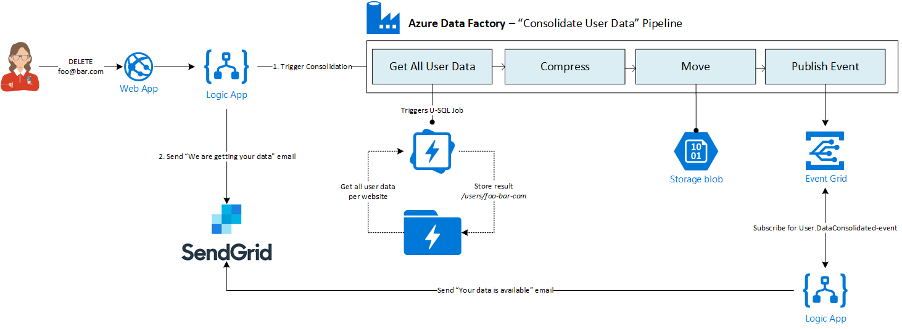

# How to be GDPR compliant in Azure
Themis Inc. is a fictiuous company that provides a SaaS platform. This SaaS platform stores personal data and integrates with the StackExchange data sets.
With GDPR they need to change their platform so that they are compliant.

This sample covers the following scenarios on how you can use Microsoft Azure services to be GDPR compliant:

- [Make user information available on request](#Make-user-information-available-on-request)

## Make user information available on request
[Discussion in issues #1](https://github.com/tomkerkhove/gdpr-with-azure/issues/1)

### Business Scenario
A user needs to be capable of requesting a copy of all the stored information about a specific user. This includes both personal identifiable data, such as user profile, and application data which is the data stored by Themis Inc. that includes the StackExchange data sets.

The user data consolidation is an asynchronous process where the user can request this in the portal which starts the consolidation process.
Once this is completed, the user will receive an email with a link where they can download their data up to 7 days.

### Technical Overview
The process consists of a few steps:
1. User requests consolidation via portal
2. Portal triggers the process by calling a Logic App to perform the following steps:
   1. Get the user profile for the user by calling the User service
   2. Trigger the consolidation process via a REST call. This also specifies the user his first name, last name & email address
   3. Send an email to the user that the process has started
3. Consolidation process is an Azure Data Factory pipeline that resembles the consolidation process:
    1. Get all user information that is stored in the database. This is done via a stored procedure
    2. Get all application data from the StackExchange data set that relates to the user.
    By using Azure Data Lake Analytics we can easily scale the interpretation of the StackExchange data set out by using a U-SQL script
    3. Compress & move the data to Azure Blob Storage
4. Send an email to the user with a link to his data via a Logic App

