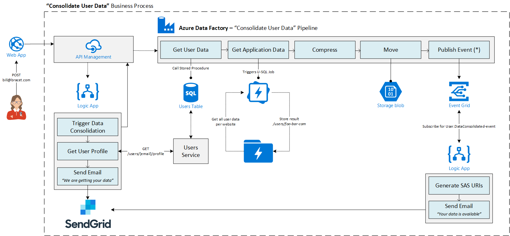

# How to be GDPR compliant in Azure
Scenarios on how you can use Microsoft Azure services to be GDPR compliant:

- [Make user information available on request](#Make-user-information-available-on-request)

## Make user information available on request
[Discussion in issues #1](https://github.com/tomkerkhove/gdpr-with-azure/issues/1)

